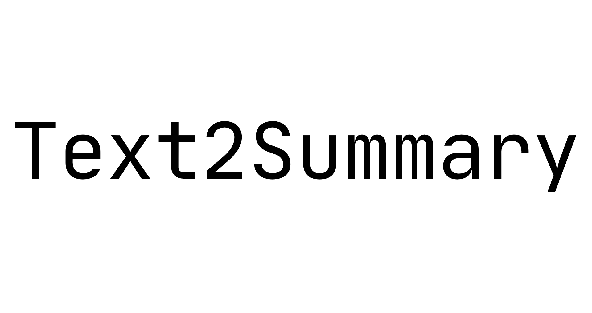

# Text2Summary API



[](https://jitpack.io/#shubham0204/Text2Summary-Android)

[](https://forthebadge.com)

Text2Summary API uses on-device methods to perform text summarization on Android applications. It uses extractive text summarization 
to give you the most important sentences from a given text.

You may [read the story of Text2Summary on Medium](https://medium.com/@equipintelligence/introducing-text2summary-text-summarization-on-android-674b62419019).

* [Installation](#installation)
* [Usage](#usage)
* [More on Text2Summary](#more-on-text2summary)
* [Contribute](#contribute)

> Please note that this library is in development. So, it will be prone to frequent changes. Developers are welcomed to open issues and share their feedback.

## Installation

First, we need to add the JitPack Maven repository to the root-level `build.gradle` file,

```
allprojects {
    repositories {
        // Other dependencies
        maven { url 'https://jitpack.io' }
    }
}
```

Then in the module-level `build.gradle` file, add the Text2Summary dependency,

```
dependencies {
    // Other dependencies
    implementation 'com.github.shubham0204:Text2Summary-Android:alpha-05'
}
```

For the latest build, see [Releases](https://github.com/shubham0204/Text2Summary-Android/releases).

## Usage

The text which needs to be summarized has to be a `String` object. Then,
use `Text2Summary.summarize()` method to generate the summary.

```kotlin

var summary = Text2Summary.summarize( someLongText , compressionRate = 0.7 )

```
The number `0.7` is referred as the compression factor. Meaning, given a text of 10 sentences, a summary of 7 sentences will be
produced. This number must lie in the interval `( 0 , 1 ]`.

You may extract text from a file and then pass it to Text2Summary,

```kotlin

val bufferedReader: BufferedReader = File( "poems.txt" ).bufferedReader()
val text = bufferedReader.use{ it.readText() }
val summary = Text2Summary.summarize( text , 0.7 )

```

### Using Text2Summary for huge texts

As heavy operations are performed for the summarization, a huge text given to Text2Summary may block the `Activity` UI thread.  
To counter this, use `Text2Summary.summarizeAsync()`,

```kotlin
val callback = object : Text2Summary.SummaryCallback {
    override fun onSummaryProduced(summary: String) {
        // The summary is ready!
    }
}
Text2Summary.summarizeAsync( someLongText , 0.7f , callback  )
```

The `summarizeAsync()` method internally calls the `summarize()` method itself wrapped in a `AsyncTask`.

## More on Text2Summary

Text2Summary uses the TF-IDF algorithm for extractive text summarization. Note, this is not abstractive text summarization which
use neural networks like the Seq2Seq model. As TensorFlow Lite does not support fully the conversion of `Embedding` and `LSTM`
layers, we need to use the TF-IDF algorithm.

1. The `text` which is given to `TextSummary.summarize()` is broken down into sentences. These sentences are further brought down
to words ( tokens ).
2. Using TF-IDF algorithm, a TF-IDF score is calculated for each word.
3. Next, we take the sum of such scores for all words present in the sentence.
4. Finally, we take the top N highest scores. The corresponding sentences hold most of the information present in the text. These
sentences are then concatenated and returned as the summary.

## Contribute

If you are facing any issues, [open an issue](https://github.com/shubham0204/Text2Summary/issues) on the repository. You may
send your suggestion at equipintelligence@gmail.com.


